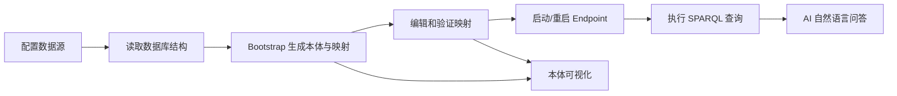

# 天织 Ontop UI 产品设计文档

## 1. 文档目的

本文档从产品视角描述天织 Ontop UI 的产品定位、核心价值、目标用户、信息架构、关键使用场景、页面策略和产品演进方向，用于统一产品、设计、研发和交付口径。

本文档基于当前版本代码实现整理，重点回答三个问题：

- 这个产品解决什么问题
- 用户为什么要使用它
- 当前版本应该如何被理解和演进

## 2. 产品概述

天织 Ontop UI 是一个围绕 Ontop 构建的语义建模工作台。它的核心价值不是替代数据库，也不是替代本体编辑器，而是在“关系数据库”和“语义查询”之间提供一个可操作、可解释、可演示的中间层。

产品想解决的问题：

- 数据库结构复杂，难以直接面向业务做语义查询
- Ontop CLI 和映射文件对普通用户门槛较高
- 本体、映射、查询、AI 问答通常分散在不同工具里
- 演示语义能力时，缺少一个完整的可视化工作台

## 3. 产品定位

产品定位为：

- 一个轻量的虚拟知识图谱工作台
- 一个 Ontop 驱动的本体管理原型平台
- 一个面向演示、验证和内部建模的语义中台前端

它不是：

- 一个正式的多租户生产平台
- 一个成熟的企业级权限系统
- 一个完整替代 Protégé 的通用本体编辑器
- 一个自带语义推理引擎的新平台

## 4. 目标用户

### 4.1 直接用户

- 数据建模工程师
- 数据平台研发
- 语义层研发人员
- 知识图谱方案设计人员

### 4.2 间接用户

- 项目经理
- 售前顾问
- 客户演示对象
- 业务分析人员

### 4.3 用户特征

这些用户通常具备以下特点：

- 熟悉数据库，但不一定熟悉 SPARQL
- 理解表、字段、外键，但不一定理解 OWL/SHACL
- 需要快速验证“数据库能否被抽象成语义层”
- 希望看到从数据接入到问答的完整闭环

## 5. 核心价值主张

天织 Ontop UI 当前版本的价值可以概括为四点：

### 5.1 降低 Ontop 使用门槛

把命令行、映射文件和端点操作包装成可视界面，使用户不必直接处理大量底层命令。

### 5.2 打通工作闭环

把“接数据源 -> 生成映射 -> 跑查询 -> 做 AI 问答 -> 看本体”放在同一个工作台中。

### 5.3 强调可解释性

AI 问答不是黑盒，用户可以看到：

- 生成的 SPARQL
- Ontop 改写后的 SQL
- 查询结果文本

### 5.4 适合演示和原型验证

它不仅能做事，还能向非技术用户说明系统在做什么，这对方案验证和售前演示很重要。

## 6. 产品目标

### 6.1 当前阶段目标

- 验证 Ontop 工作台模式是否成立
- 验证数据库到语义问答的闭环体验
- 支持内部演示和样板项目交付
- 提供结构清晰、可继续演进的代码底座

### 6.2 中期目标

- 从演示型原型升级为可持续使用的内部工具
- 增加版本管理、权限和任务管理能力
- 让 AI 助手更稳定地服务真实业务问答

### 6.3 长期目标

- 成为语义中台或本体管理平台的前端工作台
- 在特定行业场景中支持标准化建模和查询

## 7. 产品设计原则

### 7.1 工作台优先

产品不是单页面工具，而是以工作台方式组织多个环节，让用户可以顺着主线完成任务。

### 7.2 解释优先

每个页面都不只是“执行动作”，还要帮助用户理解当前状态和下一步。

### 7.3 结构优先于炫技

系统强调清晰的流程和可见的产物，而不是隐藏复杂度。

### 7.4 原型先闭环

当前阶段优先完成闭环，不优先追求企业级复杂能力。

## 8. 用户核心场景

### 8.1 场景一：从数据库快速生成语义层

目标：

- 用户想验证一个数据库是否能快速映射成知识图谱

操作路径：

1. 配置数据源
2. 读取数据库结构
3. 执行 Bootstrap
4. 查看生成文件
5. 执行 SPARQL 验证

价值：

- 缩短试错周期
- 快速得到本体和映射原型

### 8.2 场景二：修正自动生成映射

目标：

- 自动生成的映射不完全符合业务语义，需要人工修正

操作路径：

1. 打开映射编辑
2. 查看规则摘要
3. 修改 target/source
4. 保存并验证
5. 重启端点
6. 执行 SPARQL 回归验证

价值：

- 让自动化生成与人工建模结合

### 8.3 场景三：给业务方演示自然语言问答

目标：

- 非技术人员想直接提问，而不是写 SPARQL

操作路径：

1. 配置模型
2. 在 AI 助手中输入业务问题
3. 查看答案
4. 必要时展开查看 SPARQL 和 SQL

价值：

- 提升可理解性
- 支持演示和沟通

### 8.4 场景四：查看本体结构和约束

目标：

- 建模人员想快速查看类、关系和 SHACL 约束

操作路径：

1. 打开本体可视化
2. 切换图谱模式
3. 切换定义模式
4. 查看类、属性、约束

价值：

- 支持结构检查
- 支持文档化展示

## 9. 产品信息架构

产品采用“主导航 + 工作页”的结构。

主导航模块：

- 首页
- 数据源管理
- 数据库概览
- SPARQL 查询
- 映射编辑
- AI 助手
- 本体可视化
- AI 设置
- 系统设置

信息架构逻辑：

- 首页负责解释和导航
- 数据源与数据库概览负责输入端
- 映射编辑与 SPARQL 负责中间验证层
- AI 助手与本体可视化负责对外解释层
- 设置和系统页负责运行保障

## 10. 产品流程设计

### 10.1 主流程

### 10.2 页面职责分配

- `/datasource`：完成数据接入
- `/db-schema`：完成结构理解和局部建模
- `/mapping`：完成规则调整
- `/sparql`：完成技术验证
- `/ai-assistant`：完成低门槛问答
- `/ontology`：完成结构展示

## 11. 页面产品设计说明

### 11.1 首页

产品目标：

- 解释平台价值
- 作为第一次进入时的任务分发页

产品策略：

- 不把复杂操作堆在首页
- 首页负责告诉用户“你现在该去哪里”

### 11.2 数据源管理

产品目标：

- 快速建立系统与数据库之间的连接关系

产品策略：

- 操作简单直接
- 一屏看到列表和详情
- 给用户明确的“下一步动作”

### 11.3 数据库概览

产品目标：

- 让用户从关系模型角度理解建模素材

产品策略：

- 提供结构化信息而非纯 JSON
- 强调表、主键、外键、依赖关系
- 支持局部 Bootstrap 以降低风险

### 11.4 映射编辑

产品目标：

- 降低用户直接修改 `.obda` 文件的门槛

产品策略：

- 结构化呈现映射规则
- 给出规则摘要
- 验证和重启端点放在同一页，形成闭环

### 11.5 SPARQL 查询

产品目标：

- 给技术用户一个可靠的调试台

产品策略：

- 左边编辑，右边历史
- 查询结果和 SQL 一起看
- 强化“语义查询不是黑盒”的认知

### 11.6 AI 助手

产品目标：

- 把 SPARQL 交互降级为自然语言交互

产品策略：

- 结果不只给结论，还给过程
- 适合演示，也适合排查

### 11.7 本体可视化

产品目标：

- 帮助用户理解语义结构

产品策略：

- 图谱视角面向沟通
- 定义视角面向检查

### 11.8 AI 设置

产品目标：

- 让 AI 功能可配置、可替换、可调优

产品策略：

- Provider 卡片化
- 模型发现自动化
- Prompt 与快捷问题分开管理

### 11.9 系统设置

产品目标：

- 给演示和运维提供最小可见性

产品策略：

- 只读展示为主
- 让用户快速判断当前环境是否可用

## 12. 当前版本产品特征

### 12.1 优点

- 闭环完整
- 页面覆盖全面
- 适合原型验证与演示
- AI 与 SPARQL 过程可解释
- 本体图谱和定义视图并存

### 12.2 局限

- 仍偏单机工具形态
- 用户体系不完整
- 快捷问题配置尚未在 AI 页面联动
- 缺少正式版本治理和协作能力

## 13. 差异化价值

与仅提供 Ontop CLI 的方式相比，天织 Ontop UI 的差异化在于：

- 提供完整可视化工作台
- 支持从数据接入到问答的一站式流程
- 强调 AI + SPARQL + SQL 三层可解释链路
- 把本体与映射产物显式展示出来

与单纯数据库管理工具相比，它的差异化在于：

- 不是只看表结构，而是把表结构提升到语义层
- 能直接输出本体和映射
- 能进行语义查询和自然语言问答

## 14. 成功指标建议

当前阶段可关注以下产品指标：

- 成功创建数据源的次数
- 成功完成 Bootstrap 的次数
- 成功验证映射的次数
- SPARQL 查询成功率
- AI 查询成功率
- 单次演示闭环完成率

如果进入更成熟阶段，可补充：

- 日活/周活
- 页面停留时长
- AI 问答反馈满意度
- 版本切换与回滚频率

## 15. 产品路线建议

### 15.1 第一阶段：原型稳定化

- 补齐文档
- 修正页面与配置联动
- 提高端点启动和错误提示稳定性

### 15.2 第二阶段：工具化

- 增加文件版本管理
- 增加任务进度和状态反馈
- 增加更多数据库适配验证

### 15.3 第三阶段：平台化

- 增加认证和权限
- 增加多人协作
- 增加审计和配置治理
- 增加环境隔离和正式部署能力

## 16. 产品结论

天织 Ontop UI 当前最适合被定义为：

- 一个面向语义建模的工作台原型
- 一个把 Ontop 产品化表达出来的界面层
- 一个适用于内部验证、方案演示和样板项目的语义平台

它的关键价值不在于某一个页面，而在于把多个专业步骤串成了一个用户能真正走完的闭环。
